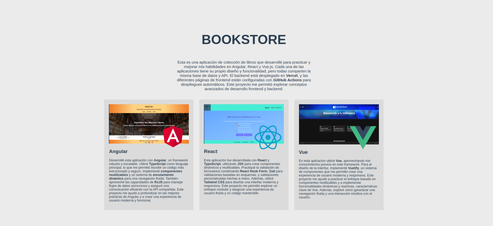

# Bookstore

Este proyecto es una aplicación de colección de libros que desarrollé para practicar y mejorar mis habilidades en **Angular**, **React** y **Vue.js**. Cada una de las aplicaciones tiene su propio diseño y funcionalidad, pero todas comparten la misma base de datos y API. El backend está desplegado en **Vercel**, y las diferentes páginas de frontend están configuradas con **GitHub Actions** para despliegues automáticos.

---

## 🚀 **Características**
- Aplicaciones desarrolladas con Angular, React y Vue.js.
- Backend desplegado en **Vercel**.
- Navegación fluida y diseño responsivo.
- Uso de tecnologías modernas como **TypeScript**, **Tailwind CSS** y **Vuetify**.
- Despliegues automáticos con **GitHub Actions**.

---

## 🖼️ **Capturas de pantalla**
### Página principal

